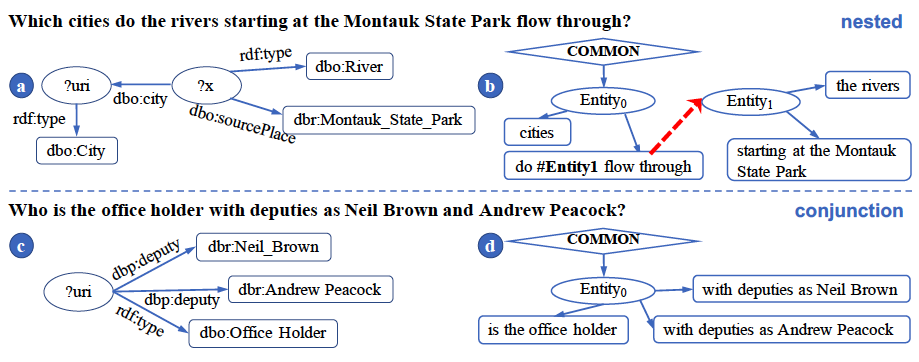
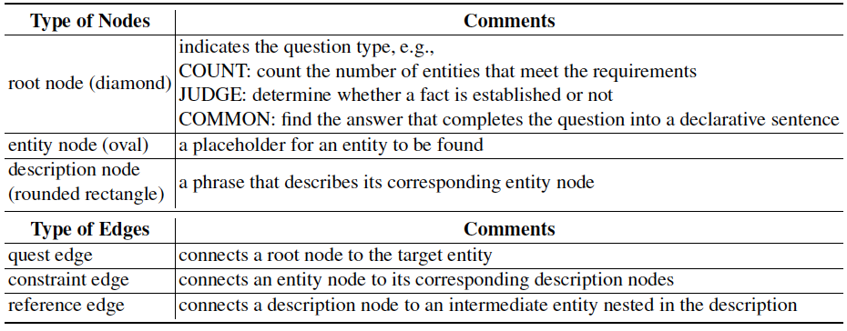

# EDGQA

Codes for ISWC 2021 research track paper "EDG-based Question Decomposition for Complex Question Answering over Knowledge Bases".

## Citation
```
@inproceedings{Hu2021edg,
  author    = {Xixin Hu and
               Yiheng Shu and
               Xiang Huang and
               Yuzhong Qu},
  editor    = {Andreas Hotho and
               Eva Blomqvist and
               Stefan Dietze and
               Achille Fokoue and
               Ying Ding and
               Payam M. Barnaghi and
               Armin Haller and
               Mauro Dragoni and
               Harith Alani},
  title     = {EDG-Based Question Decomposition for Complex Question Answering over
               Knowledge Bases},
  booktitle = {The Semantic Web - {ISWC} 2021 - 20th International Semantic Web Conference,
               {ISWC} 2021, Virtual Event, October 24-28, 2021, Proceedings},
  series    = {Lecture Notes in Computer Science},
  volume    = {12922},
  pages     = {128--145},
  publisher = {Springer},
  year      = {2021},
  url       = {https://doi.org/10.1007/978-3-030-88361-4\_8},
  doi       = {10.1007/978-3-030-88361-4\_8},
}
```

## What is EDGQA?

EDGQA is a QA system over knowledge bases based on Entity-Description Graphs (EDGs). Currently EDGQA has been implemented for DBpedia, tested on LC-QuAD 1.0 and QALD-9.




The above figure shows SPARQL (a. and c.) and EDG (b. and d.) on two exemplar natural language questions. The dashed line connects a description to an intermediate entity.
The types of nodes and edges of EDG is defined as follows.





By generating such EDGs, questions are represented as a combination of entities and their description, providing a structure for understanding and answering complex questions. More information are detailed in our paper.


## 1. Requirements

- JDK 1.8.0
- Maven
- python 3.6

Knowledge base dumps and linking systems are also needed.

### 1.1 Knowledge Base

In EDGQA, `DBpedia 1604` (for lcquad) and `DBpedia 1610` (for qald-9) is stored in `Virtuoso`. 

You can deploy the dbpedia locally or use the online endpoint (can be incompatible to the datasets). 
Then fill the server address and port in `src/main/java/cn/edu/nju/ws/edgqa/utils/kbutil/KBUtil.java`.

- [DBpedia 1604](http://downloads.dbpedia.org/2016-04/)
- [Virtuoso](http://vos.openlinksw.com/owiki/wiki/VOS/VOSDownload)

### 1.2 Linking tools

`Earl`, `Falcon`, `Dexter` are used in EDGQA. 

See directory [linking_tools](https://github.com/HXX97/EDGQA/tree/main/linking_tools), and follow the instructions to set up the three linking systems.
Then fill in the server address and port in 
`src/main/java/cn/edu/nju/ws/edgqa/utils/linking/LinkingTool.java`.

For more information:
- [Dexter](https://github.com/dexter/dexter)
- [EARL](https://github.com/AskNowQA/EARL)
- [Falcon](https://github.com/AhmadSakor/falcon)

### 1.3 Semantic matching models
EDGQA employs bert-based classifier as semantic matching models for relation detection and query reranking.

See directory [models](https://github.com/HXX97/EDGQA/tree/main/models) to deploy the models correctly. 


## 2. Run QA

### 2.1 Run EDGQA

Program arguments are defined in `src/main/java/cn/edu/nju/ws/edgqa/main/QAArgs.java`.

Running settings for [Intellij IDEA 2019.3 above versions](https://www.jetbrains.com/idea/) are stored in `EDGQA/.run`.

Run `src/main/java/cn/edu/nju/ws/edgqa/main/EDGQA.java` by following CLI arguments:

```text
-d --dataset: 'lc-quad', 'qald-9'
-tr --train: 'true' for training set, 'false' for test set
-r --run: 'autotest', 'single', or 'serial_number'
-uc --use_cache: 'true' for using linking cache, 'false' otherwise
-cc --create_cache: 'true' for creating linking cache, 'false' otherwise
-gll --global_linking: 'true' for using global linking, 'false' otherwise
-lll --local_linking: 'true' for using local linking, 'false' otherwise
-qd --question_decomposition: 'true' for using EDG to decompose the question
-rr --reranking: 'true' for re-ranking by EDG block, 'false' otherwise
```

Because the linking tools consume a lot of time, caching the linking results of the test queries helps improve the speed
of the test. The cache needs to be built the first time the QA is run and is available when it is run again. Use the
arguments `use_cache` and `create_cache` above to set the cache tool.

**[Optional]** The cache of linking results is available on this [Google Drive dir](https://drive.google.com/drive/folders/1-JX9VfyDqA51aVZ35HSCtSkvTLpsc-Aw?usp=sharing). Please set it to the current directory, i.e., `EDGQA/cache`. It is optional for running EDGQA. 

### 2.2 Run PointerNetworkQA

Run `cn/edu/nju/ws/edgqa/handler/PointerNetworkQA.java` by following CLI arguments:

```text
--dataset: 'lc-quad', 'qald-9'
```

## 3. Resources

- [PKUmod paraphrase dict](https://github.com/pkumod/Paraphrase/blob/master/dic.txt)
- [QALD-9](http://2018.nliwod.org/challenge)
- [BERT by Google Research](https://github.com/google-research/bert)
- [java-string-similarity](https://github.com/rrice/java-string-similarity)


## 4. Contact

Feel free to create a [GitHub Issue](https://github.com/HXX97/EDGQA/issues) or send an e-mail. We look forward to receiving your feedback.

